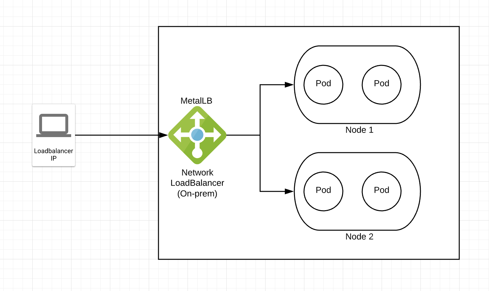

# Task 1

## Kubernetes deployment usding kubeadm with Ansible and Vagrant

This repo contains the source for deploying a bare metal kubernetes cluster in minutes using Kubeadm, vagrant and ansible. The cluster can be up and running in no time using Makefile.

## High Level Diagram

### Install Requirements
    
    1. Vagrant
    2. Ansible ( pip3 install ansible)
    3. Virtualbox

### Running the cluster

`make start`

### Stop the cluster

`make stop`

### Destroying the cluster

`make destroy`

### SSH into master

`make ssh-master`

### SSH into Node-1

`make ssh-node1`

### Features

    1. Automated deployment using Ansible. Adding new nodes is easy.
    2. Network Load Balancer using MetalLB for using service type LoadBalancer.
    3. Uses calico as overlay network
